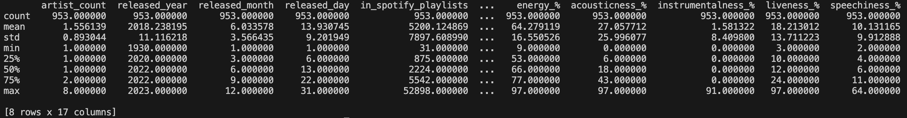

# Individual_Project_1
[](https://github.com/nogibjj/Peter_Min_Data_Engineering_Individual_Project1/actions/workflows/install.yml)
[](https://github.com/nogibjj/Peter_Min_Data_Engineering_Individual_Project1/actions/workflows/format.yml)
[](https://github.com/nogibjj/Peter_Min_Data_Engineering_Individual_Project1/actions/workflows/lint.yml)
[](https://github.com/nogibjj/Peter_Min_Data_Engineering_Individual_Project1/actions/workflows/test.yml)

This is the README for my Individual Project 1 for the IDS706 - Data Engineering Systems class at Duke University.

## Project Structure
```
Peter_Min_Data_Engineering_Individual_Project1
├── .devcontainer/
│   ├── devcontainer.json
│   └── Dockerfile
├── .github/
│   └── workflows/
│       ├── format.yml
│       ├── install.yml
│       ├── lint.yml
│       └── test.yml
├── mylib/
│   ├── lib.py
├── .gitignore
├── main.ipynb
├── main.py
├── Makefile
├── README.md
├── requirements.txt
├── spotify_data.html
├── spotify-2023.csv
├── stream_count_summary.md
├── summary_statistics.png
├── test_lib.py
├── test_main.py
└── top_10_artists_by_stream_count.png
```

## Dataset
The dataset comes from Kaggle, a public machine learning and data science community. It contains a CSV file of detailed information regarding the most-streamed Spotify songs in 2023. Link: https://www.kaggle.com/datasets/nelgiriyewithana/top-spotify-songs-2023/data

## Data Visualization
For the visualization, I analyzed and visualized the 10 hottest artists by their stream counts using [Pandas](pandas.pydata.org)


## Summary Statistics
Here is a glimpse into the summary statistics for certain columns from the dataset by running `dataframe.describe()`:



## Demo Video
Here is the [link](https://youtu.be/omky9cwbipQ) to my demo video on YouTube.
